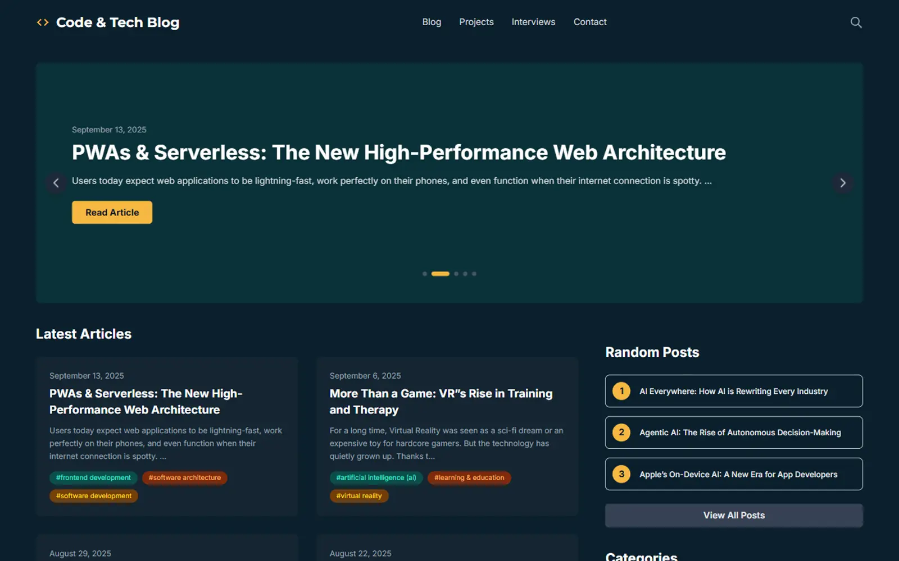
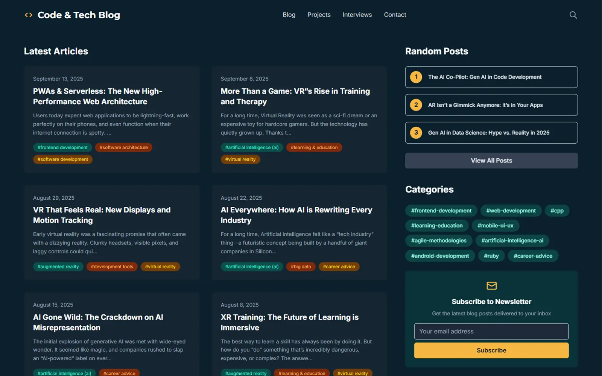
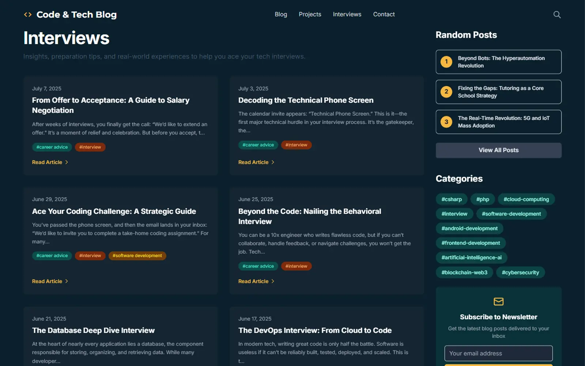

# Code & Tech

[](LICENSE)
[](https://github.com/halil-yesilyurt/code-and-tech/commits/main)
[](https://github.com/halil-yesilyurt/code-and-tech/stargazers)
[](https://github.com/halil-yesilyurt/code-and-tech)
[](https://github.com/halil-yesilyurt/code-and-tech)

A modern, high-performance tech blog built with Next.js 16 and headless WordPress. Designed for developers and tech enthusiasts, it offers fast performance, clean UI, and fully decoupled content management.

## 🚀 Live Demo

| Layer             | URL                                                                                                        |
| ----------------- | ---------------------------------------------------------------------------------------------------------- |
| **Frontend**      | [https://code-and-tech.halilyesilyurt.com](https://code-and-tech.halilyesilyurt.com)                       |
| **WordPress API** | [https://code-and-tech-wp.halilyesilyurt.com/wp-json](https://code-and-tech-wp.halilyesilyurt.com/wp-json) |

## 📖 Project Overview

**Code & Tech** combines:

- A **WordPress backend** for content management and editorial workflow
- A **Next.js frontend** for modern, fast UI with optimal performance
- Full **API-driven architecture** for complete decoupling

You manage posts through WordPress, and every published article automatically appears on the frontend with optimized performance, SEO, and beautiful presentation.

## 🖼️ Screenshots

**Homepage**

<div align="center">



</div>

**Blog Listing Page**

<div align="center">



</div>

**Single Post Page**

<div align="center">


</div>

**Interviews Section**

<div align="center">



</div>

**Category Page**

<div align="center">


</div>

## ✨ Key Features

### Core Features

- ⚡ **Headless Architecture:** Fully decoupled WordPress backend and Next.js frontend
- 🚀 **SSG & SSR:** Combines Static Site Generation for pages and Server-Side Rendering for dynamic content
- 📈 **SEO Optimized:** Automatic meta tags, Open Graph, Twitter cards, sitemaps, RSS feed, and structured data
- 🎨 **Responsive Design:** Modern UI built with Tailwind CSS 4, fully mobile-friendly
- ⚛️ **Production-Ready:** Optimized for Vercel deployment with edge caching

### Content Management

- Built on **standard WordPress** features:
  - Posts
  - Categories
  - Tags
- ✅ **No ACF required**
- ✅ **No custom post types needed**
- **Interviews** → simply a category named "Interviews"
- **Advanced Search:** Full-text search with autocomplete suggestions
- **Category & Tag Filtering:** Easy browsing with deep linking

### User Experience

- 🎯 **Hero Slider:** Dynamic homepage carousel showcasing featured articles
- 📁 **Projects Showcase:** Curated portfolio section with dedicated API, separate from WordPress
- 🎤 **Interviews Section:** Dedicated page filtering posts from "Interviews" category
- 👤 **Author Pages:** Author profiles with bio and post listings
- 📧 **Contact Form:** Modern, validated form with email integration via Resend
- 📬 **Newsletter Signup:** Integrated newsletter form for audience growth
- 🔗 **Social Sharing:** Share articles on Twitter, LinkedIn, and Facebook

### Technical Features

- 🔒 **Rate Limiting:** Built-in API rate limiting for spam protection
- 🛡️ **Error Boundaries:** Graceful error handling with React Error Boundaries
- ⏳ **Loading States:** Skeleton screens and loading indicators
- 🖼️ **Optimized Images:** Smart image loading with fallback states and lazy loading
- 📊 **Structured Data:** JSON-LD for articles and organization
- ✨ **Modern UI/UX:** Smooth animations, gradients, and clean design

## 🛠️ Tech Stack

### Frontend

- **Framework:** Next.js 16 (App Router + Turbopack), React 19
- **Styling:** Tailwind CSS 4, custom CSS modules
- **Fonts:** Geist Sans, Montserrat, Inter
- **Data Fetching:** Native `fetch` API with ISR/SSR
- **State Management:** React hooks, local state
- **Forms & Validation:** React, custom validation, server-side validation
- **Email Service:** Resend API
- **Deployment:** Vercel

### Backend

- **CMS:** Headless WordPress (self-hosted VPS or any hosting provider)
- **API:** WordPress REST API

#### Optional Plugins

- **JWT Authentication for WP REST API** – only if you need authenticated endpoints
- **WPS Hide Login** – for custom WordPress login URL security

> ✨ **Note:** Project runs perfectly with vanilla WordPress—no plugins required for basic functionality.

## 🧱 Project Structure

```bash
code-and-tech/
  ├── build.js         # Custom build script (wraps next build, disables telemetry)
  ├── docs/            # Documentation (PRD, tech stack, setup guides, etc.)
  ├── public/          # Static assets (images, icons, screenshots, etc.)
  ├── src/
  │   ├── app/         # Next.js app directory (pages, components, API routes)
  │   │   ├── api/     # Next.js API routes (projects, search suggestions)
  │   │   ├── blog/    # Blog pages and components
  │   │   ├── components/  # Reusable React components
  │   │   ├── projects/    # Projects showcase
  │   │   ├── interviews/  # Interviews section (category-based)
  │   │   └── ...      # Other pages (contact, categories, search, etc.)
  │   └── lib/         # Utilities (WordPress API client, rate limiting)
  ├── package.json
  ├── tsconfig.json
  └── next.config.ts
```

## 🧠 Pages Overview

| Route              | Purpose                                                |
| ------------------ | ------------------------------------------------------ |
| `/`                | Homepage: Hero slider, featured posts, latest articles |
| `/blog`            | All blog posts with filters and pagination             |
| `/blog/[slug]`     | Individual blog post with reading time, share buttons  |
| `/projects`        | Portfolio/projects showcase with tech stack tags       |
| `/interviews`      | Dedicated interviews section (category-based)          |
| `/categories`      | List of post categories with post counts               |
| `/category/[slug]` | Posts filtered by category                             |
| `/search`          | Full-text search with autocomplete and filters         |
| `/contact`         | Contact form with email integration and social links   |
| `/[slug]`          | Dynamic WordPress pages (About, etc.)                  |

## 📦 Prerequisites

- **Node.js** v18.x or higher
- **npm**, **yarn**, or **pnpm**
- **WordPress** (self-hosted, VPS, or managed hosting—any provider works)
- **Resend Account** (for contact form emails)

## ⚡ Installation & Setup

### 1. Backend (WordPress) Setup

1. Set up your WordPress site (locally, VPS, managed hosting—your choice).
2. Set Permalinks to **"Post name"** in WordPress Settings → Permalinks for clean URLs.
3. **(Optional)** Install plugins for enhanced functionality:
   - **JWT Authentication for WP REST API** – only if you need authenticated API calls
   - **WPS Hide Login** – only if you want to hide `/wp-admin`
4. Create your content using standard posts, categories, and tags:
   - For interviews, create an **"Interviews"** category and assign posts to it
   - No custom post types or ACF fields are required

### 2. Frontend Setup

1. **Clone the repository:**

   ```bash
   git clone https://github.com/halil-yesilyurt/code-and-tech
   cd code-and-tech
   ```

2. **Install dependencies:**

   ```bash
   npm install
   # or
   yarn install
   # or
   pnpm install
   ```

3. **Configure environment variables:**
   ```bash
   cp env.example .env.local
   # Edit .env.local with your WordPress API endpoint and other secrets
   ```

---

## 🔑 Environment Variables

Create a `.env.local` file in the root directory:

```env
# WordPress REST API Endpoints (required)
WORDPRESS_API_URL="https://code-and-tech-wp.halilyesilyurt.com/wp-json"
NEXT_PUBLIC_WORDPRESS_API_URL="https://code-and-tech-wp.halilyesilyurt.com/wp-json"

# Resend email service (required for contact form)
RESEND_API_KEY="re_xxxxxxxxxxxxxxxxxxxxxxxxxxxxxxxxxxxxxxxx"
RESEND_FROM_EMAIL="noreply@code-and-tech.halilyesilyurt.com"

# Contact email destination (required)
CONTACT_EMAIL="your-email@example.com"

# WordPress authentication (optional - only needed for authenticated API calls)
WORDPRESS_JWT_SECRET="your-jwt-secret"
WORDPRESS_USERNAME="your-wp-username"
WORDPRESS_PASSWORD="your-wp-application-password"

# Google verification / analytics (optional)
NEXT_PUBLIC_GOOGLE_SITE_VERIFICATION="xxxxxxxxxxxxxxxxxxxxxxxxxxxxxxxxxxxxxxxxxxx"
NEXT_PUBLIC_GA_ID="G-XXXXXXXXXX"
```

### Environment Variables Explained

**Required:**

- `WORDPRESS_API_URL` / `NEXT_PUBLIC_WORDPRESS_API_URL`: Your WordPress REST API base URL
- `RESEND_API_KEY`, `RESEND_FROM_EMAIL`: Resend email service credentials
- `CONTACT_EMAIL`: Destination address for contact form submissions

**Optional:**

- `WORDPRESS_JWT_SECRET`, `WORDPRESS_USERNAME`, `WORDPRESS_PASSWORD`: Only for JWT-protected endpoints
- `NEXT_PUBLIC_GOOGLE_SITE_VERIFICATION`: Google Search Console verification
- `NEXT_PUBLIC_GA_ID`: Google Analytics / GA4 measurement ID

---

## 🏃 Running the Application

**Development:**

```bash
npm run dev
# Starts the dev server at http://localhost:3000
```

**Build:**

```bash
npm run build
# Runs a custom build.js script (wraps 'next build', disables telemetry)
```

**Start:**

```bash
npm run start
# Starts the production server
```

> **Note:** WordPress must be running independently and accessible via the configured API URL.

## 🚀 Deployment

### Vercel (Recommended)

1. Push your repository to GitHub
2. Import the project into [Vercel](https://vercel.com)
3. Set environment variables in the Vercel dashboard:
   - Add all variables from your `.env.local` file
   - Make sure to use your actual WordPress API URL
4. Deploy!

**Benefits:**

- ✅ Incremental Static Regeneration (ISR)
- ✅ Automatic builds on push
- ✅ Fast edge caching
- ✅ Zero-config deployment

The project is designed and optimized for Vercel. For other platforms (Netlify, Railway, etc.), custom configuration may be required.

## 🔄 Migration Notes

If you're upgrading from an earlier version of Code & Tech:

✔ **Update `.env.local`** with your own WordPress URLs  
✔ **Plugins are now optional** – blog works with vanilla WordPress  
✔ **API structure unchanged** – only base URL needs updating

> ✅ No breaking API changes.

## 💡 Suggestions for Customization

- **Projects API:** Replace with your own external data source or connect to a portfolio API
- **Custom Post Types:** Add via ACF or CPT UI plugin if you need more content types
- **JWT Protection:** Add JWT authentication for admin-only features or protected content
- **Styling:** Personalize colors, fonts, and spacing using Tailwind configuration
- **Analytics:** Add custom tracking, heatmaps, or conversion tools
- **Comments:** Integrate Disqus, Commento, or custom comment system

## 🧑‍💻 Contributing

Contributions are welcome! To contribute:

1. Fork the repository
2. Create a feature branch (`git checkout -b feature/your-feature`)
3. Make your changes and commit (`git commit -m 'Add feature'`)
4. Push to your fork (`git push origin feature/your-feature`)
5. Open a Pull Request on GitHub

Feel free to open PRs, report issues, or suggest features!

## 📄 License

This project is licensed under the MIT License. See the [LICENSE](LICENSE) file for details.

MIT License — do whatever you want responsibly 🎯

## 🙏 Acknowledgments

- **Next.js Team** for the incredible React framework
- **WordPress Community** for the powerful CMS
- **Tailwind CSS** for the utility-first styling framework
- **Vercel** for seamless hosting and deployment
- **Resend** for reliable email delivery
- All open-source contributors who make projects like this possible

---

**Built with ❤️ by [Halil Yesilyurt](https://halilyesilyurt.com)**

**Happy Coding! 🚀**
