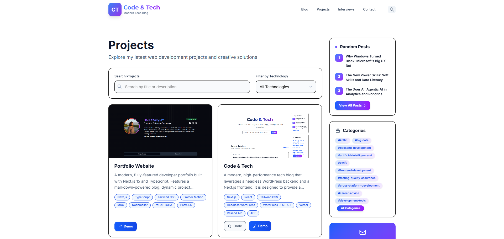

# Code & Tech


[](LICENSE)
[](https://github.com/halil-yesilyurt/code-and-tech/commits/main)
[](https://github.com/halil-yesilyurt/code-and-tech/stargazers)
[](https://github.com/halil-yesilyurt/code-and-tech/network)
[](https://github.com/halil-yesilyurt/code-and-tech)
[](https://github.com/halil-yesilyurt/code-and-tech)

A modern, high-performance tech blog built with Next.js and headless WordPress. Designed for developers and tech enthusiasts, it features a beautiful UI, blazing-fast performance, and a fully decoupled content management experience.

---

## 🚀 Live Demo

[View the Live Site](https://code-and-tech.vercel.app/)

---

## 📖 Description

**Code & Tech** is a modern, high-performance tech blog that leverages a headless WordPress backend and a Next.js frontend. It is designed to provide a seamless, fast, and SEO-optimized reading experience for tech enthusiasts, developers, and content creators. The project decouples content management from presentation, allowing editors to use the familiar WordPress dashboard while delivering a blazing-fast, modern frontend.

---

## 🖼️ Screenshots

Here are some screenshots of the Code & Tech blog:

**Homepage**


**Article Page**


**Contact Page**



---

## ✨ Key Features

- **Headless Architecture:** Decoupled WordPress backend and Next.js frontend for flexibility and performance.
- **Static Site Generation (SSG) & Server-Side Rendering (SSR):** Combines SSG for most pages and SSR for dynamic content, ensuring fast load times and great SEO.
- **SEO Optimized:** Automatic meta tags, Open Graph, Twitter cards, sitemaps, and structured data for maximum discoverability.
- **Responsive Design:** Fully mobile-friendly and accessible, with a modern UI built using Tailwind CSS.
- **WordPress Backend:** Content managed via the WordPress dashboard, supporting posts, categories, tags, and custom fields.
- **Advanced Search:** Full-text search for articles, tutorials, and insights.
- **Category & Tag Filtering:** Easily browse posts by category or tag, with deep linking.
- **Author Pages:** Dedicated author profiles with bio and post listings.
- **Contact Form:** Modern, validated contact form with email integration and spam protection.
- **View Tracking:** Tracks post popularity and displays trending articles.
- **Rate Limiting:** Built-in API rate limiting for spam protection.
- **Newsletter Signup:** Integrated newsletter form for audience growth.
- **Modern UI/UX:** Animations, gradients, and a clean, professional look.

---

## 🛠️ Tech Stack

### Frontend
- **Framework:** Next.js 13+ (App Router), React 18
- **Styling:** Tailwind CSS, custom CSS modules
- **Data Fetching:** Native `fetch` API, ISR/SSR, SWR (optional)
- **State Management:** React hooks, local state
- **Forms & Validation:** React, custom validation, server-side validation
- **Deployment:** Vercel 

### Backend
- **CMS:** Headless WordPress
- **API:** WordPress REST API
- **Plugins:**
  - Advanced Custom Fields (ACF)
  - JWT Authentication for WP REST API (for login)

---

## 📦 Prerequisites

- **Node.js** v18.x or higher
- **npm**, **yarn**, or **pnpm**
- **WordPress** (local or remote instance)
- **Required WordPress Plugins** (see above)

---

## ⚡ Installation & Setup

### 1. Backend (WordPress) Setup

1. Ensure your WordPress site is running (locally or remotely).
2. Install and activate the required plugins:
   - Advanced Custom Fields (ACF)
   - JWT Authentication for WP REST API
3. Set Permalinks to "Post name" in WordPress settings for clean URLs.
4. Configure ACF fields and custom post types as needed.

### 2. Frontend Setup

1. Clone the repository:
   ```bash
   git clone https://github.com/halil-yesilyurt/code-and-tech
   cd code-and-tech
   ```
2. Install dependencies:
   ```bash
   npm install
   # or
   yarn install
   # or
   pnpm install
   ```
3. Copy the example environment file and configure it:
   ```bash
   cp .env.example .env.local
   # Edit .env.local with your WordPress API endpoint and other secrets
   ```

---

## 🔑 Environment Variables

Create a `.env.local` file in the root directory. Example:

```env
# WordPress REST API Endpoint (server-side)
WORDPRESS_API_URL="https://your-wordpress-site.com/wp-json"

# WordPress REST API Endpoint (client-side)
NEXT_PUBLIC_WORDPRESS_API_URL="https://your-wordpress-site.com/wp-json"

# WordPress JWT Secret (for authentication, if used)
WORDPRESS_JWT_SECRET="your-jwt-secret"

# Resend API Key (for contact form)
RESEND_API_KEY="re_xxxxxxxxxxxxxxxxxxxxxxxxxxxxxxxxxxxxxxxx"

# Contact Email (for receiving contact form submissions)
CONTACT_EMAIL="your-email@example.com"
```

- `WORDPRESS_API_URL`: The base URL for your WordPress REST API (server-side).
- `NEXT_PUBLIC_WORDPRESS_API_URL`: The base URL for your WordPress REST API (client-side, exposed to browser).
- `WORDPRESS_JWT_SECRET`: Secret key for JWT authentication (if login/auth is enabled).
- `RESEND_API_KEY`: API key for Resend email service (contact form).
- `CONTACT_EMAIL`: Email address to receive contact form submissions.

---

## 🏃 Running the Application

- **Development:**
  ```bash
  npm run dev
  # Starts the dev server at http://localhost:3000
  ```
- **Build:**
  ```bash
  npm run build
  # Builds the production app
  ```
- **Start:**
  ```bash
  npm run start
  # Starts the production server
  ```

---

## 🚀 Deployment

- **Vercel:**
  - Push your repo to GitHub.
  - Import into Vercel and set environment variables in the dashboard.
  - Deploy!

Deployment is designed and tested for Vercel. For other platforms, custom configuration may be required.

---

## 🤝 Contributing

Contributions are welcome! To contribute:
1. Fork the repository
2. Create a feature branch (`git checkout -b feature/your-feature`)
3. Make your changes and commit (`git commit -m 'Add feature'`)
4. Push to your fork (`git push origin feature/your-feature`)
5. Open a Pull Request on GitHub

---

## 📄 License

This project is licensed under the MIT License. See the [LICENSE](LICENSE) file for details.

---

## 🙏 Acknowledgments

- **Next.js Team** for the React framework
- **WordPress Community** for the CMS
- **Tailwind CSS** for the styling framework
- **Vercel** for hosting
- All open-source contributors

---

**Happy coding! 🚀**
