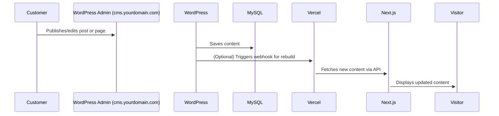

# Product Requirements Document (PRD)

## Project: Headless WordPress Blog with Next.js

**Goal:**
A performant, secure, and free blog where content is managed in WordPress (hosted on InfinityFree, admin on a subdomain) and displayed via a custom Next.js frontend (hosted on Vercel).

---

## 1. Core Features

### WordPress CMS (Backend)

- Authors manage content via WordPress admin panel (`/wp-admin`) on a subdomain (e.g., `cms.yourdomain.com`).
- Posts and pages are stored in WordPress's MySQL database (InfinityFree).
- REST API enabled for content delivery (`/wp-json/wp/v2/`).

### Next.js Frontend

- Deployed on Vercel (free tier).
- Fetches posts and pages from WordPress REST API.
- Uses Static Generation (SSG) with Incremental Static Regeneration (ISR) for near-real-time updates.
- Dynamic routes for posts and pages.
- Responsive, modern UI.

### Deployment

- **Frontend:** Vercel (with custom domain or subdomain, e.g., `blog.yourdomain.com`).
- **Backend:** InfinityFree (WordPress on subdomain, e.g., `cms.yourdomain.com`).
- **Domain:** Custom domain with DNS configured for both frontend and backend.

---

## 2. Security Requirements

### WordPress Hardening

- Install and configure:
  - JWT Authentication for WP REST API
  - WPS Hide Login (custom login path)
  - Wordfence Security
- Disable XML-RPC in `wp-config.php`:
  ```php
  define('XMLRPC_ENABLED', false);
  ```
- Use strong, unique admin credentials.
- Keep WordPress and plugins up to date.

### Frontend Security

- Use environment variables for API URLs and secrets.
- Avoid client-side API calls for sensitive data (use SSG/ISR or SSR).
- Never expose JWT secrets in the frontend.

---

## 3. Performance & SEO

- **ISR (Next.js):** Revalidate pages every 60 seconds (`revalidate: 60`).
- **Optimized Images:** Use WordPress `_embed` API and Next.js `Image` component.
- **SEO:** Dynamically generate meta tags (title, description, og:tags) from WordPress content.
- **Fast Hosting:** Vercel's CDN for frontend, InfinityFree for backend.

---

## 4. User Flow



---

## 5. Risks & Mitigations

| Risk                     | Mitigation                                    |
| ------------------------ | --------------------------------------------- |
| Exposed WordPress API    | JWT Auth, rate limiting, hide login URL       |
| Brute-force attacks      | WPS Hide Login, strong passwords, Wordfence   |
| Outdated plugins         | Enable auto-updates, use Wordfence            |
| Frontend API abuse       | Use SSG/ISR, avoid client-side fetching       |
| CORS/API errors          | Configure CORS in JWT plugin, test endpoints  |
| Free hosting limitations | Monitor uptime, be ready to migrate if needed |

---

## 6. Free Hosting Setup

- **WordPress:** InfinityFree (with MySQL DB, on subdomain)
- **Frontend:** Vercel (automatic CI/CD, custom domain or subdomain)
- **Domain:** Use registrar DNS to point subdomains to correct hosts

---

## 7. Technical Requirements

### WordPress Backend

- Hosted on InfinityFree (or similar free PHP host)
- Plugins:
  - JWT Authentication for WP REST API
  - WPS Hide Login
  - Wordfence
- XML-RPC disabled in `wp-config.php`
- Admin panel on subdomain (e.g., `cms.yourdomain.com`)

### Next.js Frontend

- Use `create-next-app` with TypeScript
- Fetch posts/pages via WordPress REST API (`/wp-json/wp/v2/posts?_embed`)
- Implement ISR (`revalidate: 60`)
- Dynamic routes for posts (`/posts/[slug]`) and pages (`/pages/[slug]`)
- Responsive, modern UI

### Deployment

- Deploy frontend to Vercel (connect to GitHub repo)
- Set up environment variables in Vercel dashboard
- (Optional) Set up deploy hook (webhook) in Vercel and configure WordPress to trigger it on content updates

---

## 8. Security & Performance Checklist

- [ ] Hide `/wp-admin` with a custom path
- [ ] Secure API with JWT (block unauthorized access)
- [ ] Use environment variables for API URLs and secrets
- [ ] Optimize images with Next.js `Image`
- [ ] Implement ISR for incremental updates
- [ ] Keep WordPress/plugins up to date
- [ ] Use strong passwords and enable 2FA if possible

---

## 9. Deliverables

1. **GitHub repository** with:
   - Next.js frontend code
   - Documentation for WordPress setup
2. **Deployed Vercel demo** (custom domain or subdomain)
3. **Postman collection** for testing the WordPress API
4. **PRD and setup documentation**

---

## 10. Key Considerations & Points to Be Careful About

- **DNS Configuration:** Ensure subdomains point to correct hosts (Vercel for frontend, InfinityFree for backend).
- **CORS Issues:** Configure CORS in JWT plugin to allow frontend domain.
- **Free Hosting Limits:** InfinityFree may have downtime or resource limits—monitor and be ready to migrate if needed.
- **Security:** Never expose sensitive credentials. Use strong passwords and keep everything updated.
- **Webhooks:** If using ISR with webhooks, test thoroughly to ensure instant updates.
- **No PHP on Vercel:** WordPress must stay on a PHP host; Vercel is for frontend only.
- **Customer Training:** Provide clear instructions for using the WordPress admin on the subdomain.
- **Backups:** Encourage regular backups of WordPress content (use free plugins like UpdraftPlus).

---

## 11. Notes

- Prioritize free-tier solutions.
- No client-side API calls for sensitive data (use SSG/ISR).
- Document all security steps for the user.
- Responsive, accessible, and SEO-friendly frontend.

---

Would you like to add screenshots, diagrams, or video references for any step? Or focus on automating the WordPress setup further?

🏠 Pages
Page Purpose
/ (Home) Featured/latest blog posts, search, categories
/blog All blog posts (with filter/sort by category, tag)
/about Info about you, your experience, your goals
/categories List of post categories with post counts
/tags (optional) More specific filtering
/contact (optional) Email form, social links, GitHub, etc.
/projects (optional) Highlight personal dev projects (great portfolio bonus!)
/interviews Q&A with tech leaders (video + transcript)

🏷 Suggested Categories
Category Description
Frontend JavaScript, CSS, HTML, React, etc.
Backend Node.js, Express, APIs, databases
Dev Tools Git, VS Code, CLI tools, browser extensions
Performance Optimizing speed, SEO, Core Web Vitals
AI & Code Copilot, ChatGPT, automation with AI
Tech Reviews Reviews of tools, platforms, libraries
Projects Your personal builds, lessons learned
Tutorials Step-by-step how-tos
Firebase Backend-as-a-service tutorials
Linux / DevOps (if interested) Commands, setups, workflow tools

📝 Example Blog Post Titles
Topic Type Sample Titles
Frontend “How I Built a Responsive Grid in Tailwind”
“Fixing Z-index Issues with Real-World Examples”
Backend “Build a Simple API with Express and MongoDB”
Dev Tools “10 VS Code Extensions I Use Daily”
“Git Rebase vs Merge: Visual Guide”
AI & Code “How I Use ChatGPT to Write Better Commit Messages”
“Letting GitHub Copilot Write My Unit Tests”
Project Log “Building CodeAndTech — My Blog from Scratch with Next.js”
Tutorials “Add Dark Mode to Your Site with Tailwind & Next.js”
Performance “Optimize Image Loading with next/image”
Firebase “Set Up Auth and Firestore in 10 Minutes”

📌 SEO + UX Enhancements
Featured post component on homepage

Estimated reading time

Table of contents for long articles

Code syntax highlighting (with copy button)

Light/dark mode

Search bar (Fuse.js or Algolia)

Newsletter form (optional, later)
